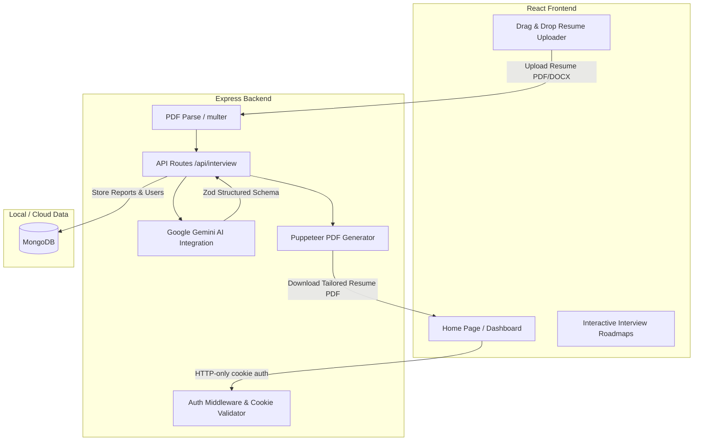

# Interview-AI: AI-Powered Interview Strategist & Tailored Resume Generator

An advanced, full-stack web application designed to help job seekers tailor their profiles for specific job descriptions and prepare for technical/behavioral interviews. By integrating Google Gemini AI and server-side PDF compilation, the platform provides tailored interview questions, a structured daily study plan, and an ATS-friendly, dynamically customized PDF resume.

---

## 🚀 Key Features

* **AI Profile Matcher**: Calculates an accurate compatibility score between the candidate's resume/self-description and the target job description.
* **Structured Daily Roadmaps**: Uses Google Gemini's structured JSON outputs to generate a customized, day-by-day study plan to cover identified skill gaps.
* **Tailored Technical & Behavioral Practice**: Generates targeted interview questions, underlying interviewer intentions, and optimal model answers.
* **Dynamic Resume Tailoring & PDF Download**: Rewrites relevant sections of the candidate's experience to align with the target job and compiles it into an ATS-friendly PDF using server-side **Puppeteer**.
* **Interactive Drag & Drop**: A modern, interactive UI zone supporting click-to-upload and drag-and-drop file uploads (PDF & DOCX) with size and extension validation.
* **Secure JWT Authentication**: Implements HTTP-only cookie-based authentication and a token blacklist system for secure logouts.

---

## 🛠️ Tech Stack

### Frontend
* **Core**: React 19 (Vite), React Router 7
* **Styling**: Vanilla Sass (SCSS)
* **API Client**: Axios (configured with credentials for secure cookie transport)

### Backend
* **Runtime & Framework**: Node.js, Express
* **Database**: MongoDB (Mongoose ODM)
* **AI Engine**: Google Gemini AI (using the official `@google/genai` SDK)
* **Validation**: Zod (for validating and structuring LLM outputs)
* **PDF Compiler**: Puppeteer (Headless Chrome document rendering)
* **Security & Auth**: JSON Web Tokens (JWT) & Cookie Parser

---

## 📁 System Architecture



---

## ⚙️ Local Setup Instructions

### Prerequisites
* [Node.js](https://nodejs.org/) (v18+ recommended)
* [MongoDB](https://www.mongodb.com/) running locally or an Atlas connection URI

### 1. Backend Configuration
1. Navigate to the backend directory:
   ```bash
   cd Backend
   ```
2. Install dependencies:
   ```bash
   npm install
   ```
3. Create a `.env` file in the `Backend` directory and populate it:
   ```env
   PORT=3000
   MONGO_URI=mongodb://localhost:27017/interview-ai
   GOOGLE_GENAI_API_KEY=your_gemini_api_key_here
   JWT_SECRET=your_secure_random_hex_secret
   ```
4. Start the backend development server:
   ```bash
   npm run dev
   ```

### 2. Frontend Configuration
1. Navigate to the frontend directory:
   ```bash
   cd ../Frontend
   ```
2. Install dependencies:
   ```bash
   npm install
   ```
3. Start the frontend development server:
   ```bash
   npm run dev
   ```
4. Open your browser and head to `http://localhost:5173`.

---

## 🔒 Security & Best Practices
* **XSS Protection**: Session tokens are transmitted via `HttpOnly` and `Secure` (in production) cookies, ensuring they cannot be read or hijacked via client-side JavaScript.
* **Token Blacklisting**: Used to permanently invalidate JWTs on logout to prevent replay attacks.
* **Type-Safe AI Response**: Leverages Zod schemas mapped to Gemini's `responseSchema` options, guaranteeing type-safety and preventing runtime parser crashes.
