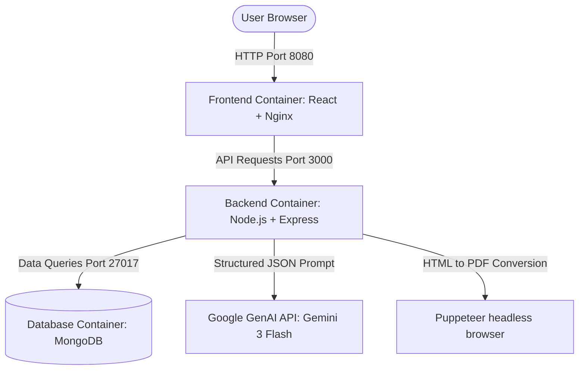
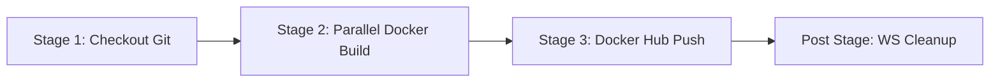

# 📋 Presentation Guide: AI Job Preparation Platform

An enterprise-grade, DevOps-engineered AI platform designed to analyze resumes, optimize them for ATS (Applicant Tracking Systems), generate tailored resume PDFs, and conduct mock interview assessments using the latest Google Gemini models.

---

## 🏗️ 1. High-Level Architecture
The platform is built on a decoupled **three-tier architecture** containerized via Docker and orchestrated with custom bridge networks.

---

## 💻 2. Technical Stack

### **A. Frontend (Client-side)**
- **React 19:** State-of-the-art UI library for rendering modular views.
- **Vite 7:** Next-generation frontend build tool providing hot module reloading (HMR) for local development and extremely fast build times.
- **Sass (SCSS):** Structured stylesheet compilation for custom styling.
- **React Router 7:** Single Page Application (SPA) routing for secure auth guards.
- **Axios:** CORS-enabled HTTP client for backend service queries.

### **B. Backend (Server-side API)**
- **Node.js (v20) & Express (v5):** High-performance backend routing engine.
- **Multer:** Handles file upload stream buffering using system memory (`multer.memoryStorage()`) to prevent filesystem bloat.
- **Puppeteer:** Spawns a headless Chromium instance to render dynamic HTML resumes and export them into print-ready A4 PDF buffers.

### **C. Database**
- **MongoDB 7:** NoSQL document database chosen for storing flexible schema data like resume formats, generated questions, and user session structures.
- **Mongoose 9:** ODM (Object Document Mapper) for structured MongoDB interactions.

---

## 🤖 3. Artificial Intelligence Integration

The core intelligence is powered by **Google's Gemini 3 Flash Preview** model via the official `@google/genai` SDK.

### **Key AI Patterns Used:**
1. **Tailored Resume Generation:** Tailors a user's resume for a specific Job Description and outputs structured HTML formatted for print.
2. **Structured JSON Outputs (Zod Schema Validation):**
   To prevent unstructured AI text output, the backend enforces a rigorous JSON schema using **Zod** and **zod-to-json-schema**. This ensures the AI *only* returns clean, parseable JSON arrays of interview questions and skill gap rankings.
3. **Structured Schema Output Fields:**
   - `matchScore`: Percentage score comparing candidate skillsets to job requirements.
   - `technicalQuestions`: Intention-based technical question sets.
   - `behavioralQuestions`: Behavioral evaluation scenarios.
   - `skillGaps`: Labeled skill gaps mapped with severity levels (`low`, `medium`, `high`).
   - `preparationPlan`: A customized day-by-day learning roadmap.

---

## ⚙️ 4. DevOps & Infrastructure

This project is a prime demonstration of **Infrastructure as Code (IaC)**, **Microservices Orchestration**, and **CI/CD Automation**.

### **A. Microservices Orchestration (Docker Compose)**
All microservices are declared in `docker-compose.yml`:
- **`mongo`**: Serves database requests and maintains data persistent mounts (`mongo-data`).
- **`backend`**: Exposes port `3000` and configures target environment links.
- **`frontend`**: Built via multi-stage Docker and served on port `8080`.
- **`app-network`**: A private bridge network isolating container-to-container communication.

### **B. Safe Production Containerization (Dockerfiles)**
- **Multi-Stage Builds:** Dockerfiles build source modules in separate stages and copy *only* built distribution folders to runtime containers, reducing image size by up to 70%.
- **Security Hardening:** The Backend Dockerfile establishes a custom non-root system group/user (`appgroup`/`appuser`) to execute Node.js processes, adhering to the principle of least privilege.

---

## 🔄 5. CI/CD Pipelines

Two distinct automated CI/CD configurations exist to show pipeline flexibility:

### **A. GitHub Actions Pipeline (`docker-ci.yml`)**
*Target: Cloud-native SaaS CI*
- Triggers automatically on code pushes and pull requests.
- Leverages GitHub runner containers.
- Automatically builds and tags Docker images with the Git commit hash (`${{ github.sha }}`) and the `latest` tag.
- Publishes images to Docker Hub on branch merging.

### **B. Jenkins Declarative Pipeline (`Jenkinsfile`)**
*Target: Self-hosted/Enterprise CI*

- Orchestrates checkout, builds frontend & backend images **in parallel** (to reduce pipeline execution time), logs in securely to Docker Hub using Jenkins credentials, and publishes tags dynamically.

---

## 🎯 6. End-to-End Workflow Demo

To showcase the platform in action, trace this workflow:
1. **User Upload:** User uploads their PDF resume and job description to the React frontend.
2. **API Dispatch:** React POSTs the file metadata to `http://localhost:8080/api/interview`.
3. **Nginx Routing:** Nginx proxies the frontend and routes the API request to the backend.
4. **AI Generation:** Backend calls Gemini, sending the resume and job description. Gemini returns structured JSON containing interview questions and learning tracks.
5. **PDF Assembly:** The backend feeds tailored HTML to a Puppeteer instance, compiles a professional PDF, saves the transaction to MongoDB, and returns it to the client.
6. **Download:** The client receives the generated file, and the user downloads a tailored resume.
